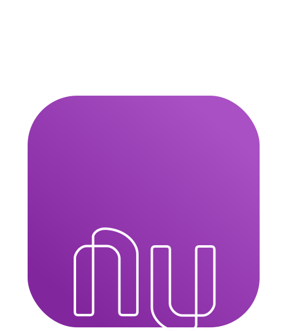

# Projeto Nubank 🟪

> Projeto educacional de criação de landing page para o banco digital Nubank.

## 🎯 Objetivo 

O objetivo desse projeto é desenvolver minhas habilidades em desenvolvimento de páginas web responsivas aplicando boas práticas e técnicas de interatividade, como motion design e animações.

## 📝 Descrição

> Esse projeto faz parte do curso [Frontpush](https://frontpush.com.br/).

As tecnologias utilizadas foram: Figma, HTML, CSS + SASS, JavaScript e Animate On Scroll Library.

## 🌐 Visualização
Você pode conferir o projeto clicando [aqui](https://netoodev-nubank.vercel.app/) ou a partir do link: https://netoodev-nubank.vercel.app/
